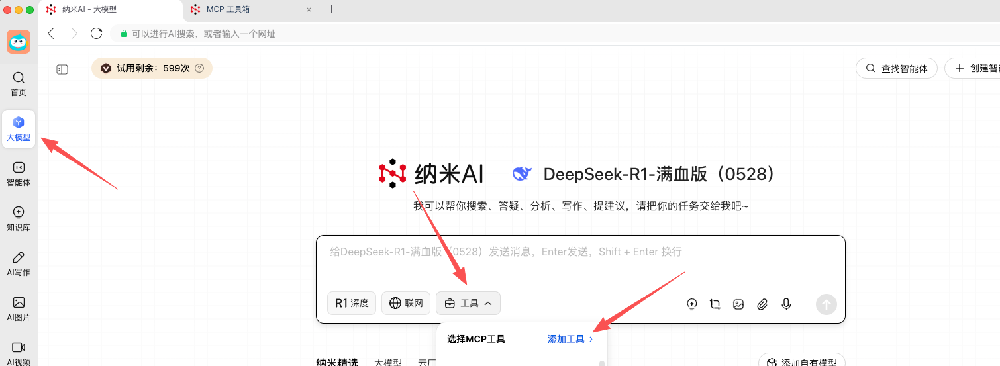
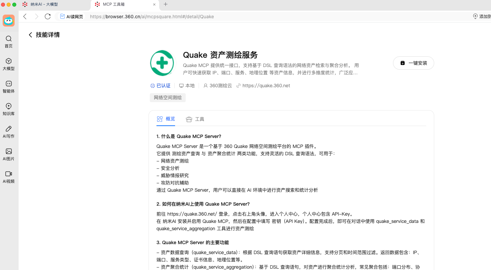

# Quake MCP Server

> 中文说明：[README_CN.md](README_CN.md).

## Overview

**Quake MCP Server** is a Model Context Protocol (MCP) plugin based on the **360 Quake Network Space Mapping Platform**. It provides two main functionalities:

- **Asset Data Query**: Retrieve detailed network asset information.
- **Asset Aggregation**: Analyze and aggregate network asset data.

By leveraging the flexibility of DSL query syntax, **Quake MCP Server** enables users to conduct network asset collection, distribution analysis, security vulnerability assessment, and network space profiling. It's an essential tool for AI environments to perform real-time asset search and statistical analysis.

---

## Features

### 🔍 Asset Data Query (`quake_service_data`)

- Allows retrieval of detailed information about network assets.
- Supports filtering by query syntax, time range, and pagination.

### 📊 Asset Aggregation (`quake_service_aggregation`)

- Provides aggregated statistical data about network assets, including but not limited to::
  - Port distribution
  - Protocol/service type distribution
  - Geographical distribution

---

## Getting Started

### 1. Setup in NaMiAI

1. Search for **Quake MCP** in the [NaMiAI](https://www.n.cn/) MCP Toolbox.
2. Click **Install**, then enter your **API Key** to complete the configuration. (Login to the [Quake platform](https://quake.360.net/quake/#/personal?tab=message), navigate to **User Center → API Token**, to obtain your **API Key**)
3. Once setup is complete, you can start using the Quake MCP Server to perform asset queries and aggregation.





### 2. Server Configuration

```json
{
  "mcpServers": {
    "Quake MCP Server": {
      "disabled": false,
      "timeout": 60,
      "type": "streamableHttp",
      "url": "https://quake.360.net/mcp/",
      "headers": {
        "X-QuakeToken": "your QuakeToken"
      }
    }
  }
}
```
---

## API Usage

### 1. Asset Data Query (`quake_service_data`)

**Description**  
Fetch detailed information about network assets based on the provided query syntax.

**Parameters:**

- `query` (string, required): DSL query string (e.g., `domain:"example.com"`).
- `start_time` (string, optional): Start time for the query in UTC format.
- `end_time` (string, optional): End time for the query in UTC format.
- `start` (int, optional): Pagination start, default is `0`.
- `size` (int, optional): Number of results per page, default is `100`.

**Response:**

- `code`: Response code (0 indicates success).
- `message`: Response message (e.g., `"Successful."`).
- `total_count`: Total number of assets found.
- `data`: List of asset details (IP, port, service, geographical location, etc.).
- `meta`: Pagination details.

### 2. Asset Aggregation (`quake_service_aggregation`)

**Description**  
Returns aggregated statistical data for network assets based on a query.

**Parameters:**

- `query` (string, required): DSL query string (e.g., `country:CN`).
- `start_time` (string, optional): Start time for the query in UTC format.
- `end_time` (string, optional): End time for the query in UTC format.

**Response:**

- `code`: Response code (0 indicates success).
- `message`: Response message (e.g., `"Successful."`).
- `data`: Aggregated data (e.g., port distribution, service types, geographical distribution).

---

## Use Cases

- **Network Asset Collection**: Quickly obtain network asset information for specified domains, IPs, or organizations.
- **Asset Distribution Analysis**: Analyze the distribution of assets across ports, protocols/service types, and geographical locations.
- **Security Vulnerability Assessment**: Help identify potential risky assets and abnormal services.
- **Network Space Profiling**: Combine asset data and aggregation statistics to generate a comprehensive network space view for an organization or region.

---

## FAQ

### Q1: What is DSL query syntax?

DSL (Domain Specific Language) query syntax is used to search for assets in Quake. Example queries include:

- `domain:"example.com"`: Search for assets under the domain `example.com`.
- `port:22 AND country:CN`: Search for assets exposed on port 22 in China.

### Q2: How to obtain an API Token?

Login to the [Quake platform](https://quake.360.net/quake/#/personal?tab=message), navigate to **User Center → API Token**, and generate a new token.

### Q3: What is the query result points deduction mechanism?

The points deduction mechanism is aligned with the API call deduction system. Deduct points based on the query frequency and data retrieval.

---

## Special Notice

**Quake MCP Server** is designed to enhance the security of your network assets. By using this service, you commit to not engage in any activities that could harm computer network security. These activities include, but are not limited to:

1. **Illegal Intrusion**: Unauthorized access to others' networks, disrupting normal network functions, or stealing network data.
2. **Unauthorized Data Access**: Using unauthorized data or accessing unapproved servers/accounts.
3. **Unlawful Network Access**: Gaining unauthorized access to public computer networks or other computer systems and deleting, modifying, or adding stored information.
4. **Vulnerability Scanning or Testing**: Attempting to probe, scan, or test the weaknesses of others' systems or networks or engaging in any other actions that may harm network security.
5. **Other Illegal or Unlawful Activities**: Any other activities that are prohibited by law or regulations.

---

## Conclusion
Quake MCP Server provides an efficient and flexible way to collect, analyze, and aggregate network asset data. By integrating with AI environments and leveraging powerful querying capabilities, it allows security professionals to quickly gather data for vulnerability assessment, asset profiling, and threat intelligence.
