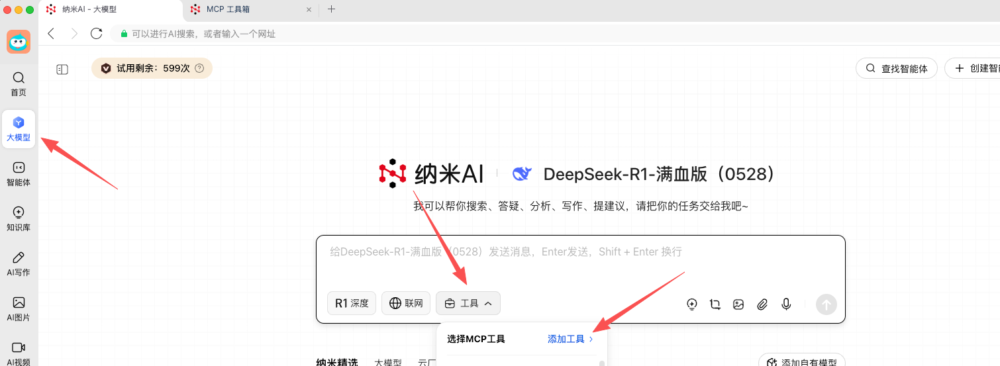
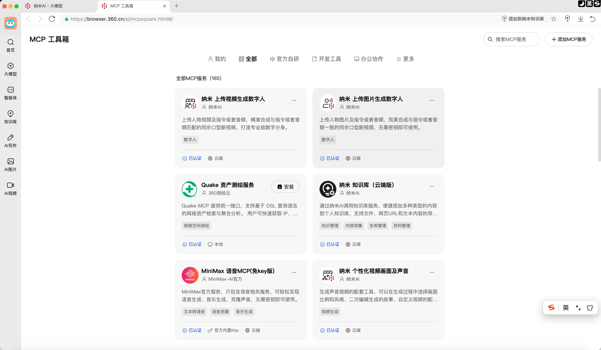
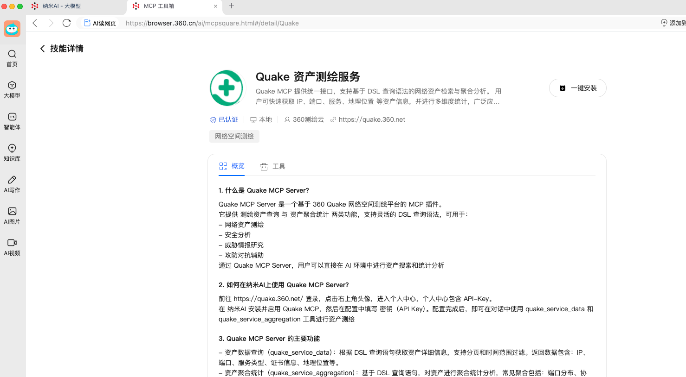

# Quake MCP Server

## 概述

**Quake MCP Server** 是基于模型上下文协议(Model Context Protocol)构建的专用网络资产测绘服务，它通过标准化接口（Streamable HTTP）将Quake平台强大的网络空间资产搜索能力封装成可被各类AI应用调用的服务。与传统的资产测绘工具不同，安全人员使用Quake MCP Server 可以快速的构建网络资产测绘智能体，借助AI大模型的推理、分析能力，可在短时间内完成目标单位资产收集、脆弱性评估、指纹画像与暴露面分析，提供全面、精准、动态的资产测绘数据支撑。

它提供了两大主要功能：

- **资产数据查询**：获取详细的网络资产信息。
- **资产聚合统计**：分析并聚合网络资产数据。

---

## 主要功能

### 🔍 资产数据查询 (`quake_service_data`)

- 获取详细的网络资产信息。
- 支持通过查询语法、时间范围和分页进行过滤。

### 📊 资产聚合统计 (`quake_service_aggregation`)

- 提供网络资产的聚合统计数据，常见聚合包括：
  - 端口分布
  - 协议/服务类型分布
  - 地理位置分布

---

## 安装

### 1. 通过纳米安装使用

1. 在 [纳米](https://www.n.cn/) 的 MCP 工具箱中搜索 **Quake MCP**。
2. 点击 **安装**，然后输入您的 **API Key** 完成配置。 (获取您的 **API Key**，请登录到 [Quake](https://quake.360.net/quake/#/personal?tab=message)，在 **用户中心** 获取 **API Token** )
3. 设置完成后，您可以开始使用 Quake MCP Server 执行资产查询和聚合。







### 2. Server 配置

```json
{
  "mcpServers": {
    "Quake MCP Server": {
      "disabled": false,
      "timeout": 60,
      "type": "streamableHttp",
      "url": "https://quake.360.net/mcp/",
      "headers": {
        "X-QuakeToken": "your QuakeToken"
      }
    }
  }
}
```

---
## API 使用

### 1. 资产数据查询 (`quake_service_data`)

**描述**  
根据提供的查询语法，获取详细的网络资产信息。

**参数：**

- `query` (string，必填)：DSL 查询字符串，例如 `domain:"example.com"`。
- `start_time` (string，可选)：查询开始时间（UTC 格式）。
- `end_time` (string，可选)：查询结束时间（UTC 格式）。
- `start` (int，可选)：分页起始位置，默认值为 `0`。
- `size` (int，可选)：每页的结果数，默认值为 `100`。

**响应：**

- `code`：响应码，`0` 表示成功。
- `message`：响应消息（例如 `"Successful."`）。
- `total_count`：找到的资产总数。
- `data`：资产详细信息列表（包括 IP、端口、服务、地理位置等）。
- `meta`：分页信息。

### 2. 资产聚合统计 (`quake_service_aggregation`)

**描述**  
根据查询返回网络资产的聚合统计数据。

**参数：**

- `query` (string，必填)：DSL 查询字符串，例如 `country:CN`。
- `start_time` (string，可选)：查询开始时间（UTC 格式）。
- `end_time` (string，可选)：查询结束时间（UTC 格式）。

**响应：**

- `code`：响应码，`0` 表示成功。
- `message`：响应消息（例如 `"Successful."`）。
- `data`：聚合数据（例如端口分布、服务类型、地理分布）。

---

## 使用场景

- **网络资产收集**：快速获取指定域名、IP 或组织的网络资产信息。
- **资产分布分析**：统计资产在端口、协议/服务类型、地理位置等维度的分布情况。
- **安全脆弱性评估**：辅助识别潜在风险资产及异常服务。
- **网络空间画像**：结合资产数据和聚合统计，生成全面的组织或区域网络空间视图。

---

## 常见问题

### Q1：什么是 DSL 查询语法？

DSL（领域特定语言）查询语法用于在 Quake 中搜索资产。示例查询包括：

- `domain:"example.com"`：查询 `example.com` 域名下的资产。
- `port:22 AND country:CN`：查询中国地区暴露在 22 端口的资产。

### Q2：如何获取 API Token？

登录到 [Quake 平台](https://quake.360.net/quake/#/personal?tab=message)，导航至 **用户中心 → API Token** 页面，生成新的令牌。

### Q3：查询结果的积分扣分机制是什么？

积分扣分机制与 API 调用的扣分机制保持一致。根据查询频率和数据检索量扣除积分。

---

## 特别提示

**Quake MCP Server** 旨在提升您的网络资产安全。通过使用此服务，您承诺不从事任何可能危害计算机网络安全的行为。这些行为包括但不限于：

1. **非法侵入**：非法侵入他人网络、干扰他人网络正常功能、窃取网络数据等危害网络安全的活动。
2. **未经授权的数据访问**：使用未经许可的数据或进入未经许可的服务器/账号。
3. **非法网络访问**：未经允许进入公众计算机网络或者他人计算机系统并删除、修改、增加存储信息。
4. **漏洞扫描或测试**：企图探查、扫描、测试他人系统或网络的弱点或实施其他破坏网络安全的行为。
5. **其他非法或违规行为**：任何法律或规定所禁止的其他违法、违规行为。


